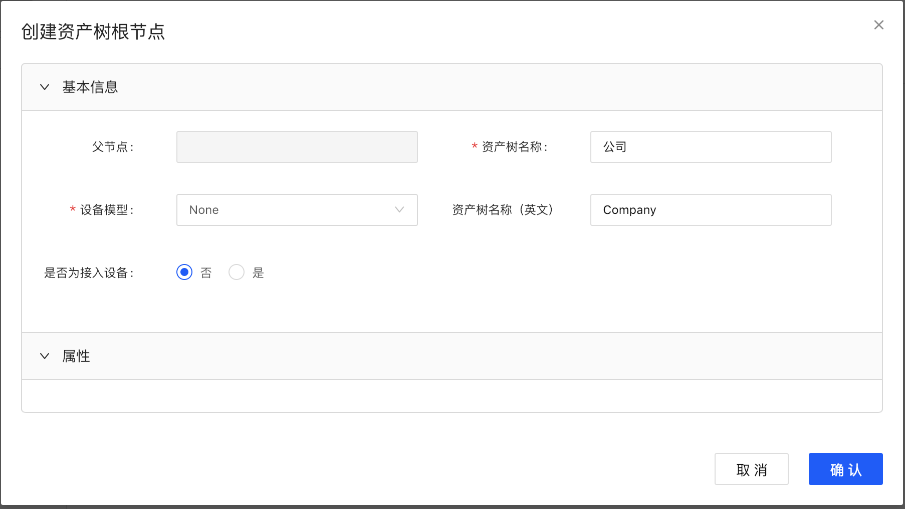
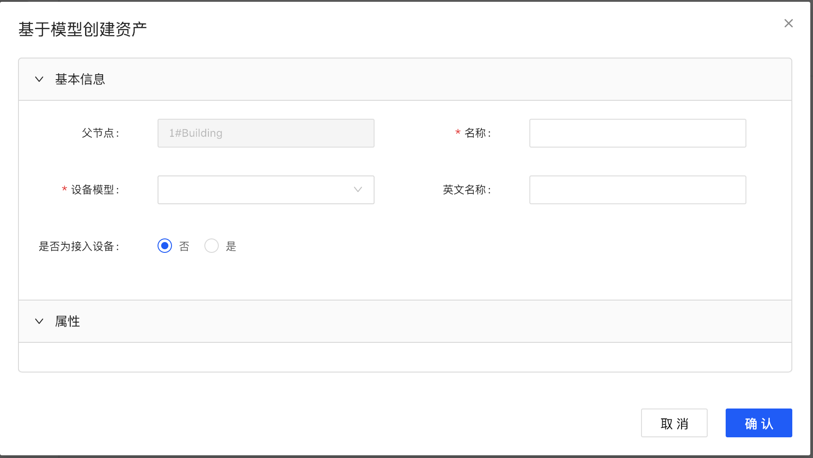

# 创建资产树

该文章描述了如何创建资产树及将资产绑定至资产树节点。

## 创建根节点

新建一棵资产树从创建树的根节点开始，资产树根节点名称就是资产树名称。步骤如下：

1. 从控制面板左侧的导航菜单中选择**资产管理**。
2. 点击左上角 **+** 按钮，创建资产树根节点。
3. 在**创建资产树根节点** 窗口进行以下配置：
   - 输入资产树名称
   - 选择设备模型
   - 选择是否为接入设备。资产树根节点一般为非接入设备。可以为资产树根节点创建模型，如果没有模型四要素，可以使用`<None>`模型作为资产树根节点的模型。`<None>`模型是一个模型四要素为空的系统内置模型。
   - 按照模型定义的功能提供对应值
      

4. 点击**确认**完成创建。

## 创建叶子节点

在创建资产树根节点以后，可以在根节点下再创建子节点。创建子节点有两种方式：
- 基于模型创建资产
- 添加已有资产到资产树

### 基于模型创建资产

1. 选中资产树节点，点击鼠标右键，选择**增加 > 添加叶子节点 > 基于模型创建资产**。

    

2. 输入资产名称，选择设备模型，并指定该设备是否为接入设备。如果是接入设备，有三种选项：
  - **绑定已有接入设备**:如果已经在**设备管理**菜单当中创建了设备，需要将其绑定到该资产树节点，可以使用此选项。
  - **快捷创建接入设备**:如果需要新建一个接入设备并绑定至该资产树节点，可以使用此选项。
  - **后续关联接入设备**:如果明确知道要创建的资产是接入设备，但是暂时不清楚设备是否已经创建，需要等后续确认以后再进行设备绑定，可以使用此选项。

    

3. 根据选择的创建方式完成配置，并点击**确认**。

### 添加已有资产到资产树

1. 选中资产树节点，点击鼠标右键，选择**增加 > 添加叶子节点 > 添加已有资产**。

  

2. 选择该资产对应的模型，并基于模型选择资产。点击**确认**以后，添加资产成功。

  
