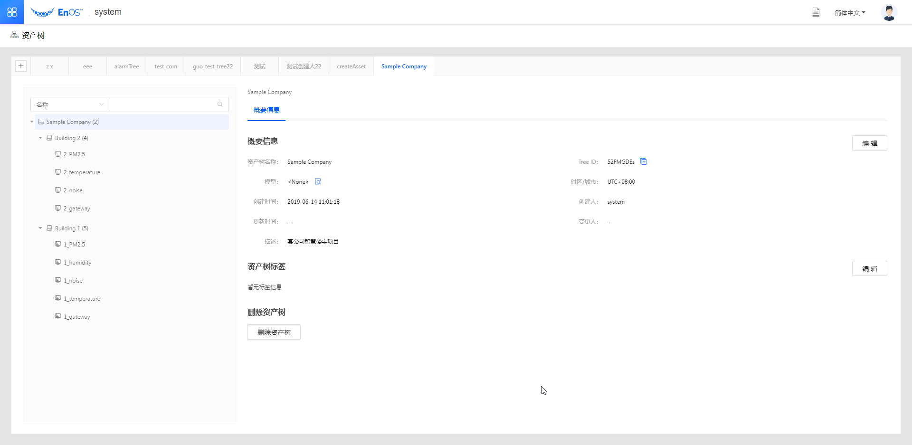
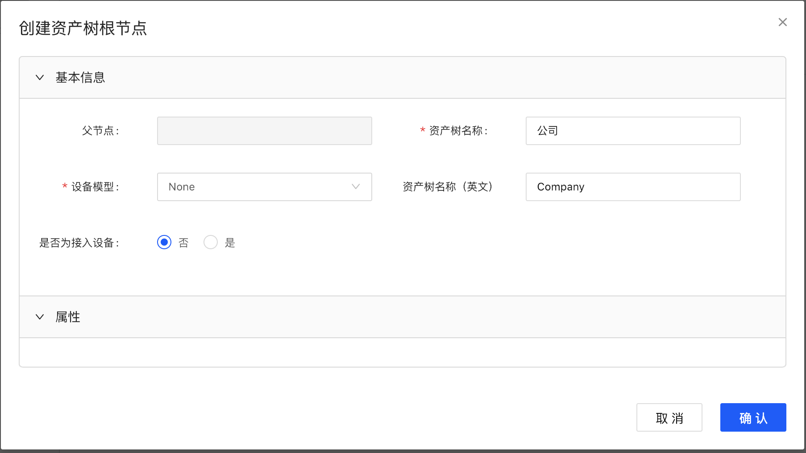
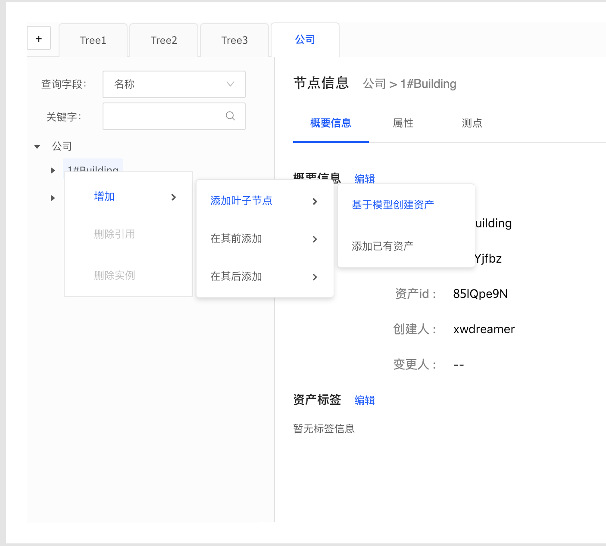
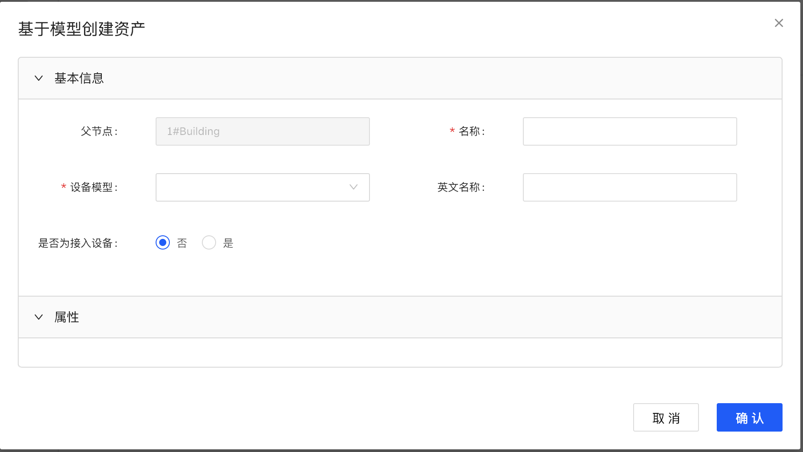
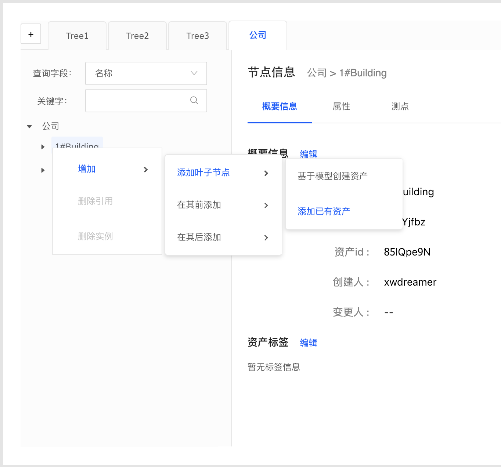
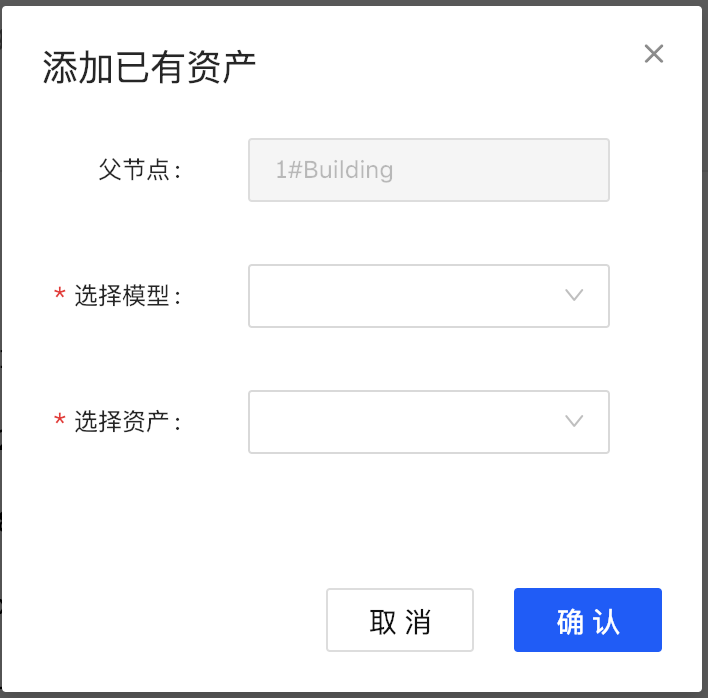

# 快速入门资产树管理

该文章通过示例场景介绍如何从0至1创建资产树并将设备等资产绑定至资产树节点。

## 场景描述

一个智慧楼宇项目，需要采集楼宇内部`PM2.5`，`温度`、`湿度`、`噪声`的参数，每一个参数都有对应的传感器，传感器与网关连接，网关负责数据采集并转发至EnOS Cloud。

每个楼宇包含的传感器类型不确定，有些楼宇上述四类传感器都有，有些楼宇可能只有其中的部分传感器。

假设有2个楼宇，楼宇包含的传感器信息如下：
- 1号楼宇
  - PM2.5
  - 温度
  - 湿度
  - 噪声
- 2号楼宇
  - PM2.5
  - 温度
  - 噪声

## 任务描述

针对以上业务场景，你需要对资产进行建模和根据资产层级构建资产树。

1. 为场景中的资产建模， 定义以下6种物模型（Thing Model）：
    + 描述设备的物模型
      a. PM2.5传感器模型
         - 测点：PM2.5

      b. 温度传感器模型
         - 测点：temperature

      c. 湿度传感器模型
         - 测点：humidity

      d. 噪声传感器模型
         - 测点：noise

      e. 网关设备模型
         - 属性：version
         - 测点：cpuRates

    + 描述设备组合的物模型
      f. 楼宇模型

  在完成创建模型以后，基于模型创建产品。

2. 根据业务场景中的资产层级构建资产树

    a. 为该组织创建资产树根节点
    b. 在根节点下创建楼宇子节点
    c. 在楼宇节点下创建传感器子节点，如果需要将网关也作为楼宇内的设备，可以将已有网关设备绑定到楼宇节点下。根据场景创建的资产树如下：

    

## 步骤1：创建模型

参考[创建模型](../model/creating_model)为上述场景的资产创建模型。

## 步骤2：创建资产树

1. 创建资产树根节点

  进入资产树界面，点击右上角**+**按钮，创建资产树根节点。资产树根节点名称就是资产树名称。资产树根节点一般为非接入设备。可以为资产树根节点创建模型，如果没有模型四要素，可以使用`<None>`模型作为资产树根节点的模型。`<None>`模型是一个模型四要素为空的系统内置模型。

  

2. 在创建资产树根节点以后，可以在根节点下再创建子节点。创建子节点有两种方式：
    - 基于模型创建资产
    - 添加已有资产到资产树

### 基于模型创建资产

1. 选中资产树节点，点击鼠标右键，选择**增加 > 添加叶子节点 > 基于模型创建资产**。

    

2. 输入资产名称，选择设备模型，并指定该设备是否为接入设备。如果是接入设备，有三种选项：
  - **绑定已有接入设备**:如果已经在**设备管理**菜单当中创建了设备，需要将其绑定到该资产树节点，可以使用此选项。
  - **快捷创建接入设备**:如果需要新建一个接入设备并绑定至该资产树节点，可以使用此选项。
  - **后续关联接入设备**:如果明确知道要创建的资产是接入设备，但是暂时不清楚设备是否已经创建，需要等后续确认以后再进行设备绑定，可以使用此选项。

    

3. 根据选择的创建方式完成配置，并点击**确认**。

### 添加已有资产到资产树

1. 选中资产树节点，点击鼠标右键，选择**增加 > 添加叶子节点 > 添加已有资产**。

  

2. 选择该资产对应的模型，并基于模型选择资产。点击**确认**以后，添加资产成功。

  
