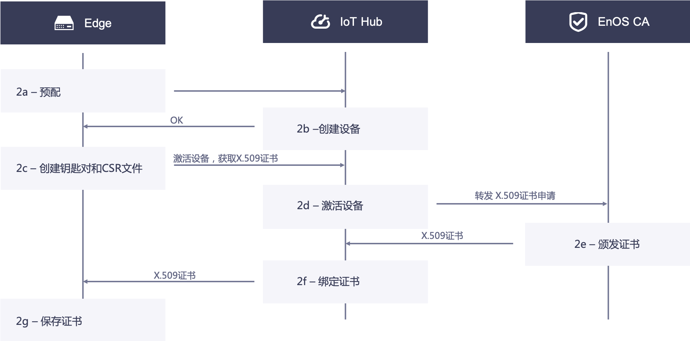
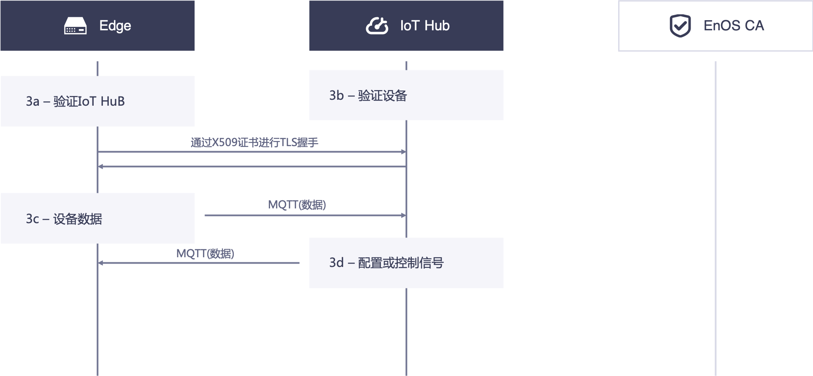
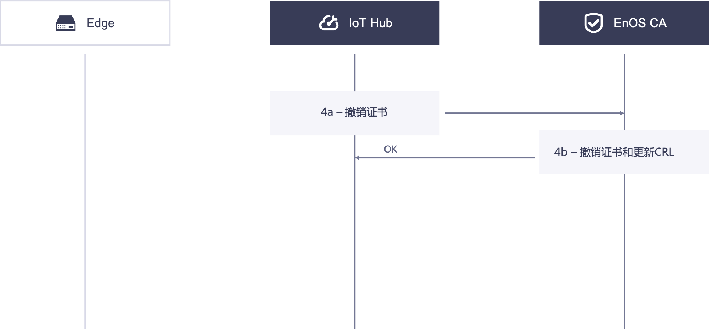

# 基于证书的双向认证

安全性是IoT系统中至关重要的一点。在产品配置中启用证书身份验证后，EnOS会强制执行以下安全方案用以保护EnOS edge和EnOS IoT Hub之间的连接：

 - EnOS edge和EnOS IoT Hub之间的通信强制使用基于证书的双向认证。
 - 支持使用RSA算法验证签名，强制使用RSA 2048位的密钥类型。

## 设置证书<setup>

下图为基于X.509证书的edge和IoT Hub之间的安全通信过程。   

### 1. IoT Hub获取X.509证书<iothubCertificate>

1a. IoT Hub在本地创建密钥对和证书请求文件（CSR文件），使用X.509证书服务的API获取包含CSR的X.509证书。

1b. EnOS CA颁发X.509证书并将证书发送至IoT Hub。

1c. IoT Hub接收并存储X.509证书。

### 2. Edge获取X.509证书<edgeCertificate>

2a. Edge设备出厂预烧录了产品证书（`ProductKey`，`ProductSecret`）和 edge设备序列号（SN）。设备上电联网以后，上报产品证书以及序列号至云端去动态激活。如果云端鉴权认证通过，会返回`DeviceSecret`至edge。

2b. 在IoT Hub上，使用edge的设备序列号作为`DeviceKey`预注册edge设备，可以在EnOS控制台注册设备，也可以通过调用REST API接口注册设备。

2c. Edge接收由IoT Hub返回的信息，创建密钥对和CSR文件，调用API获取它的X.509证书。同时使用设备三元组登录至云端，设备首次登录成功后会被激活。

2d. IoT Hub接收到从edge发来的CSR文件，在验证完身份后，将CSR文件转发至EnOS CA.

2e. EnOS CA接收到CSR文件，颁发edge证书并发送至IoT Hub。

2f. IoT Hub接收到已签发的X.509证书，把证书与设备ID绑定，然后将edge证书发送至edge。

2g. Edge接收到edge证书，需要保存到安全的本地库中。例如，保存至可信平台模块（TPM）。

## 建立通信<communication>

下图为进行基于证书认证地过程：

### 3. Edge与IoT Hub之间基于证书的双向认证的通信<edgecommunication>

3a. Edge认证IoT Hub端的证书。

3b. IoT hub认证edge端的证书

当3a和3b步骤中的TSL握手都成功后，Egde与IoT Hub之间的TLS连接即建立完成。

3c. 在TLS通道中，edge以MQTT协议传送设备遥测信息。

3d. 在TLS通道中，IoT Hub以MQTT协议传送配置和控制信号。

## 撤销证书<revocation>

在某些情况下，用户需要撤销edge的X.509证书.

下图为撤销证书的过程。

### 4. IoT Hub 撤销edge端的X.509证书<revokecertificate>

4a. IoT Hub调用撤销API来撤销edge端的带序列号的X.509证书。

4b. EnOS CA接收到来自IoT hub的请求后，验证身份，撤销证书，以及升级CRL.

## Edge安全的最佳实践<bestpractices>

在基于证书的安全连接中，参考以下最佳实践来确保edge的安全：

- 为edge创建私钥，并将私钥存放至一个安全地库。例如：TPM。
- 在与IoT Hub通信时使用TLS 1.2协议，并验证服务器证书的有效性。
- 每个edge都必须拥有唯一的公钥和私钥对。
- 由IoT Hub认证的密钥不能用于其他目的或通过其他协议进行通信。
- 当edge被重置时，密钥必须被撤回。
- 当你的edge在操作系统上运行时，确保你的操作系统上有安全机制。例如，防火墙。
- 确保你有方法来升级根CA根证书与CRL。
- 确保edge上的时钟不被篡改。
