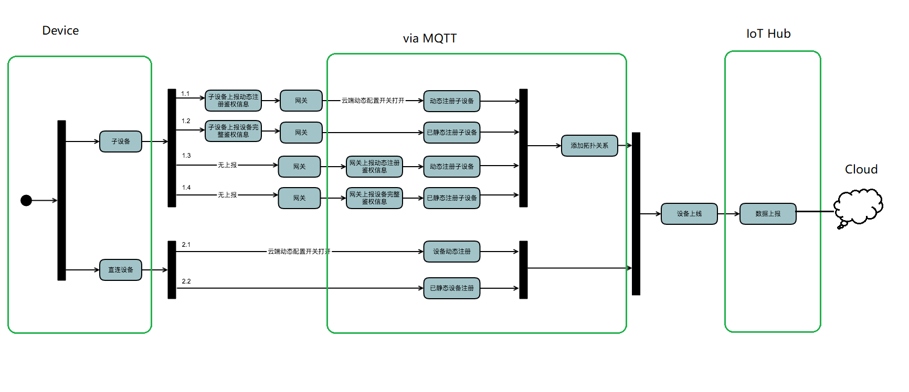

# 设备接入方案

在EnOS平台中，无论是EDGE设备，还是直连的IoT设备，都必须满足EnOS的统一鉴权、上线步骤，从而才能上报数据到平台。

## 硬件能力考虑

- 硬件具备编程能力： 一般无需网关，可直接与云端连接。

  这种场景适合于分布式设备的接入，比如一个采集棒，一个电池组的设备等。

  **Note**: 对于具有编程能力的设备， 若对安全性要求较高，也可以通过Edge与云连接。请参考子设备配置。

<!--信息来自徐伟，星期一可以再确认一下-->

- 硬件不具备编程能力： 需要通过网关与EnOS Cloud 进行连接。

  子设备不具备编程能力，它仅仅提供数据采集的场景，这种情况也是最常见的场景，比如下游子设备是一个SCADA系统，或者是一个组串式的汇流箱，通过简单的Modbus来进行数据交换。

  EnOS支持的网关产品如下：
  - EnOS Edge
  - MQTT采集器
  - 普通采集器 <!--那么普通采集器是不是需要做什么事情，比如设备端SDK把该采集器变成个MQTT client？-->

<!--有哪些支持的网关设备（采集棒）需要和徐伟确认,@Fish快点确认！-->

## 安全性考虑

- 一机一密：安全性相对较高
- 一型一密：安全性相对较弱

有关设备接入安全机制的更多信息，参考[与IoT Hub的安全连接](device_connection_security).

##  信息流

下图描绘了不同接入方式和安全机制选择方案的信息流：

<table>
   <tr>
     <th></th>
     <th>连接方式</th>
     <th>认证机制</th>
     <th>设备硬件能力</th>
   </tr>
   <tr>
     <td>1.1</td>
     <td>通过网关连接</td>
     <td>一型一密</td>
     <td>设备有编程能力</td>
   </tr>
   <tr>
     <td>1.2</td>
     <td>通过网关连接</td>
     <td>一机一密</td>
     <td>设备有编程能力</td>
   </tr>
   <tr>
     <td>1.3</td>
     <td>通过网关连接</td>
     <td>一型一密</td>
     <td>设备无编程能力</td>
   </tr>
   <tr>
     <td>1.1</td>
     <td>通过网关连接</td>
     <td>一型一密</td>
     <td>设备无编程能力</td>
   </tr>
   <tr>
     <td>2.1</td>
     <td>直连</td>
     <td>一型一密</td>
     <td></td>
   </tr>
   <tr>
     <td>2.1</td>
     <td>直连</td>
     <td>一机一密</td>
     <td></td>
   </tr>
 </table>

## 场景示例

以下为部分上述接入方案的场景示例。

### 2.1 直连，一型一密

   + 户用光伏项目使用Edge采集器接入逆变器数据并上送到云端。
   + 采集器事先烧录云端创建产品的product key和prodcut secret。
   + 在现场逆变器上电，采集器正常运行以后，采集器采集到逆变器设备的SN，然后上送设备SN，product key，product secret去平台侧动态注册设备（含有采集器的逆变器可以看成是一个具备编程能力的设备）。
   + 逆变器动态注册，拿着SN去注册设备，SN号作为device key。
    - 如果device key已经存在，直接返回device key+device secret
    - 如果device key不存在，SN号作为device key，系统动态生成device secret。device name默认等于device key，支持用户修改，但是要求保证在product下唯一。
    - 注意：device key在product下是唯一的。这个是可以保证的，一个品牌逆变器的SN是唯一的，如果是给集成商定制的逆变器，使用集成商的SN号，可以单独创建product。
   + 注册成功以后，设备拿到device name，device key， device secret， 写入到采集器当中。
   + 连接建立成功，上报数据，整个过程不需要事先创建场站和设备。
   + 领域侧开发相应的扫码app，在现场施工的经销商负责给农户创建场站信息，然后扫码逆变器SN，云端自动识别，将对应的设备挂载到创建好的场站节点下，支持用户修改device name（间接的说明，资产树没有创建并不影响接入过程）。
   + 操作完毕以后，用户能够看到逆变器从并网开始的数据，而不是从扫码以后的数据。
   说明： 设备注册是一个接口，如果传参数sn，则用sn生成device key，并返回device key，如果不穿参数，则device key动态生成，并返回动态生成的device key

### 1.4 通过网关连接，一型一密

   + 某风场项目，需要接入风机数据，风机无法直接连接云端网络，需要先通过站端USCADA汇集风机数据以后，再统一转发给站端Edge，然后站端Edge通过标准接入协议将数据上送到云端。

   + 站端Edge是具备编程能力的设备，风机是不具备编程能力的设备。适配使用1.4的场景：

      - 云端创建一个网关设备，将这个网关设备三元组<product key，device key，device secret>烧录到站端普通Edge上。网关是一种product。
      - 一个50MW风场有33台风机，云端创建33个风机设备，将这33个风机设备的三元组下发到普通Edge上（edge上就有33台风机设备了。）。风机是一种product。
      - 在Edge侧进行数据采集（规约解析），并将采集到的数据绑定mapping到对应的33台风机设备。
      - 连接与数据传输：
           网关拿着自己的三元组与云端建立网络连接通讯。
          网关拿着风机的三元组将数据送到云端指定的设备上。
   + 在资产管理控制台创建场站信息，然后将相应的设备信息放到指定的拓扑节点上。

   注意： 并不需要对风机设备烧录三元组，比较困难，所以需要在edge上去做风机设备与设备三元组绑定的操作。
