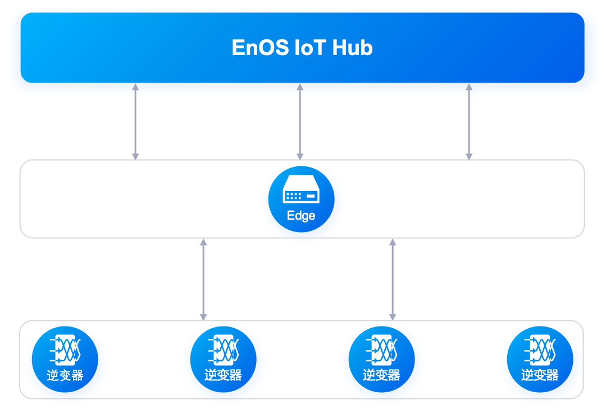
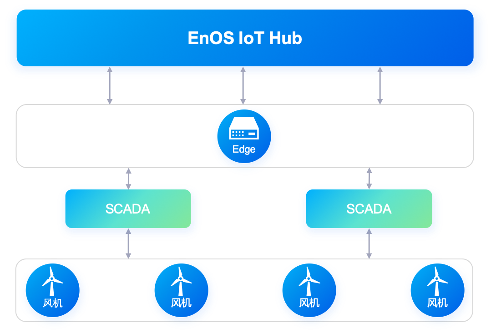
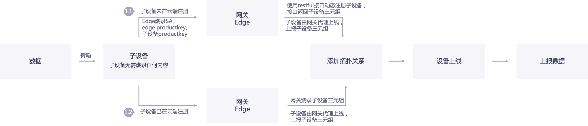
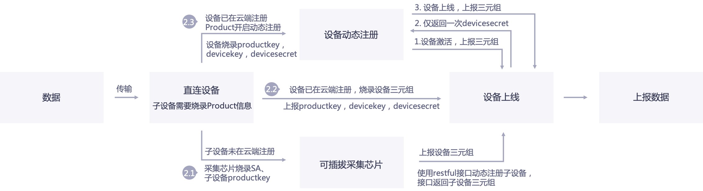

# 设备接入方案

在EnOS平台中，无论是Edge设备，还是直连IoT Hub的设备，都必须满足EnOS的统一鉴权、上线步骤，才能发送数据至平台。

EnOS主要提供以下接入方案：
- 设备直接与EnOS IoT Hub进行连接与通信，无需通过网关，<!--（在我们的方案中）-->即edge gateway，完成鉴权，数据上报的场景。通过该方案连接的设备被称为**直连设备**。
- 设备通过edge与EnOS IoT Hub进行连接。通过该方案连接的设备被称为**子设备**。网关代理子设备来帮助他们完成身份的鉴权、上线、数据发送等操作。

## 接入场景

通常根据设备的硬件能力及对设备连接的安全性要求选择接入方案。

在被接入物联网之前，首先设备要具有被连接的能力，主要体现在两方面：
- 具有联网能力
- 支持烧录固件并运行连接程序

现实世界中的设备按照以上属性主要分成两类：
- 支持烧录固件，并可通过Wifi、GPRS、3G或4G信号直连到IoT平台。
- 不支持烧录固件，也不具备Wifi、3G或4G联网的能力。该场景下，需要通过edge来采集设备的数据，设备经由edge网关连接至IoT平台。edge需要支持固件烧录和联网。

### 设备直连场景

可直接与云端连接的常见设备有：
- 带智能采集棒的设备，例如户用逆变器，户用储能电池。
- 智能家居设备，例如监控摄像头，智能温湿度计。

### 网关代理(子设备)连接场景

需要通过网关代理才能与云端连接的常见设备有：
- 分布式逆变器：网关直采多台逆变器的数据，并将数据发送至云端。

  

- 数据采集与监控系统（SCADA）：SCADA与风机直连，并采集风机数据，网关与SCADA连接，并采集SCADA数据，然后将数据发送至云端。

  

## 安全认证机制

EnOS IoT Hub支持的安全认证方式有两种：
- 基于密钥的单向认证：单向认证，相对安全性较弱，为系统默认认证方式。
- 基于证书的双向认证：双向认证，安全性高，需要用户主动开启。

有关设备接入安全认证机制的更多信息，参考[设备认证机制](deviceconnection_authentication).

## 信息流

<table>
   <tr>
     <th>场景编号</th>
     <th>连接方式</th>
     <th>激活方式</th>
     <th>是否使用SA</th>

   </tr>
   <tr>
     <td>1.1</td>
     <td>通过网关连接</td>
     <td>使用设备密钥的静态激活</td>
     <td>是</td>

   </tr>
   <tr>
     <td>1.2</td>
     <td>通过网关连接</td>
     <td>使用设备密钥的静态激活</td>
     <td>否</td>

   </tr>
   <tr>
     <td>2.1</td>
     <td>直连</td>
     <td>使用设备密钥的静态激活</td>
     <td>是</td>

   </tr>
   <tr>
     <td>2.2</td>
     <td>直连</td>
     <td>使用设备密钥的静态激活</td>
     <td>否</td>

   </tr>
   <tr>
     <td>2.3</td>
     <td>直连</td>
     <td>使用产品密钥的动态激活</td>
     <td>否</td>
   </tr>
 </table>

下列章节描述了不同接入方式和激活方式选择方案的信息流。

### 通过网关连接

#### 场景1.1：接入的子设备未注册，通过Edge动态注册

1. Edge开发者通过EnOS Console在EnOS Cloud注册一个Edge应用，并获得该应用的服务账号（SA），即`accessKey`和`accessSecret`。

2. IoT实施人员登录到EnOS Console，在客户Organization中进行如下配置：
  - 创建Edge产品，并注册Edge设备实例，来获得Edge设备三元组。
  - 为待接入edge的子设备创建产品，获得`productkey`。

3. 在Edge制造阶段，需要烧录以下凭据信息：
  - Edge应用的SA，将用于获得调用EnOS API的权限。
  - 由EnOS Cloud颁发的Edge设备三元组。
  - 待接入edge的子设备所属的产品`productkey`，以及设备所属Organization的标识，即`orgId`。

4. EnOS Cloud对edge调用Restful接口进行如下鉴权：
  - Edge携带SA来获得调用EnOS API的权限。如果服务账号不对，则无法调用EnOS API，鉴权将失败。
  - EnOS Cloud基于IAM中定义的访问权限，校验edge连接请求中携带的orgId和SA参数，并验证orgId所对应的Organization是否注册了Edge应用。如果没有注册Edge应用，鉴权将失败。
  - EnOS Cloud校验请求参数`orgId`与`productkey`的归属关系。如果`productkey`对应的产品不属于`orgId`对应的Organization，校验将不通过。

5. EnOS Cloud对edge设备进行身份认证
  - Edge默认启用基于密钥的单向认证，Edge携带三元组连接云端，云端对edge三元组进行认证，认证通过后，edge设备被允许登录。
  - Edge的首次登录会同时激活edge设备，设备状态将从**未激活**更新为**在线**。

6. 如果启用了基于证书的双向认证，证书的生成与分发过程如下（以EnOS Edge为例）：
    - EnOS Edge向EnOS IoT Hub发起证书请求，请求中携带证书请求文件（CSR文件）。
    - EnOS IoT Hub将请求转发给EnOS Certificate Service。
    - Certificate Service产生证书，并返回给IoT Hub。
    - IoT Hub记录下Edge关联的证书，并将Edge证书返回给Edge。

7. IoT实施人员配置需要通过edge接入EnOS Cloud的子设备（如逆变器，风机，储能设备等），子设备注册有以下两种方式：
    - 动态注册：在edge配置中心直接创建要接入的子设备，配置中心会调用IoT Hub的REST API在EnOS Cloud中创建设备。
    - 静态注册：在EnOS Console中创建要接入的子设备，然后在edge配置中心进行绑定。由edge代理子设备连接至EnOS Cloud。

8. 设备数据传输
  - Edge与IoT Hub直接连接，子设备由edge代理连接至EnOS IoT Hub。
  - Edge与与IoT Hub之间的数据传输，使用MQTT协议。
  - 如果启用基于证书的双向认证机制，edge与IoT Hub之间的数据传输内容将被证书加密。

#### 场景1.2：接入子设备已注册，设备三元组已保存在Edge

原理与1.1是一样的，只是1.1当中edge烧录了SA，具备调用EnOS API的权限，所以可以通过API创建子设备。而在1.2场景当中，你需要事先在云端注册子设备，获取子设备三元组信息，并提前将子设备三元组信息烧录到edge中。

在EnOS Edge配置中心进行设备连接配置的时候，需要将接入设备与预先烧录的子设备三元组绑定。

1.2场景的配置复杂度要大于1.1的场景，1.1灵活性更好，但是1.2的安全性更高。从便捷的角度，可以考虑使用1.1场景。

### 直连

#### 场景2.1：接入设备未注册，通过可插拔采集信息动态注册

以户用光伏逆变器为例进行说明。

户用光伏逆变器不支持烧录，在此场景中，需要使用采集棒进行数据采集并转发至云端。考虑采集棒只采集一台逆变器的数据，因此可以将逆变器和采集棒视为一个整体的智能设备，而采集棒支持烧录，所以可以将逆变器和采集棒作为一个可支持烧录的整体设备。

1. 在云端创建逆变器产品（在客户Organization下创建，而非在开发者Organization下创建）。

2. 采集棒开发者在开发者OU下创建采集棒应用，并获得采集棒应用的SA，`accesskey`和`accesssecret`。

3. 采集棒开发者对采集棒进行出厂配置，烧录以下凭证信息：
  - 烧录采集棒应用的SA
  - 烧录逆变器的`productKey`
  - `productKey`所属的`orgId`

4. IoT实施人员进行现场施工安装，将采集棒安装在逆变器上，将设备上电和联网。设备联网后将进行下列动作：
  - 采集棒采集逆变器序列号，将序列号作为`deviceKey`，凭借SA调用REST API接口，通过`productKey`，`deviceKey`(序列号)，`orgId`动态创建设备，并获取设备的`deviceSecret`。
  - 采集棒记录`deviceSecret`，自动烧录到设备的固件当中。
  - 采集棒采集逆变器数据，使用`productKey`，`deviceKey`，`deviceSecret`去连接云端，鉴权通过，设备上线，然后发送数据。

### 场景2.2：接入设备已注册，设备出厂烧录自身的三元组
该场景要求设备出厂的时已烧录在云端注册设备后得到的设备三元组，这种场景对于烧录要求较高，安全性最高，但是可操作性较低。

### 场景2.3：接入设备已注册，批量设备烧录相同的Product信息
解决针对2.2场景可操作性较低的情况，增加了2.3场景。即
1. 每个设备出厂批量烧录相同的产品证书（即`productKey`和`productSecret`）。
2. 设备注册可以与设备厂商的设备管理系统进行集成，每发货一批次设备，客户设备管理系统可以通过调用REST API批量注册设备。
3. 当设备发往现场、上电、联网以后可以自动与云端进行连接。
