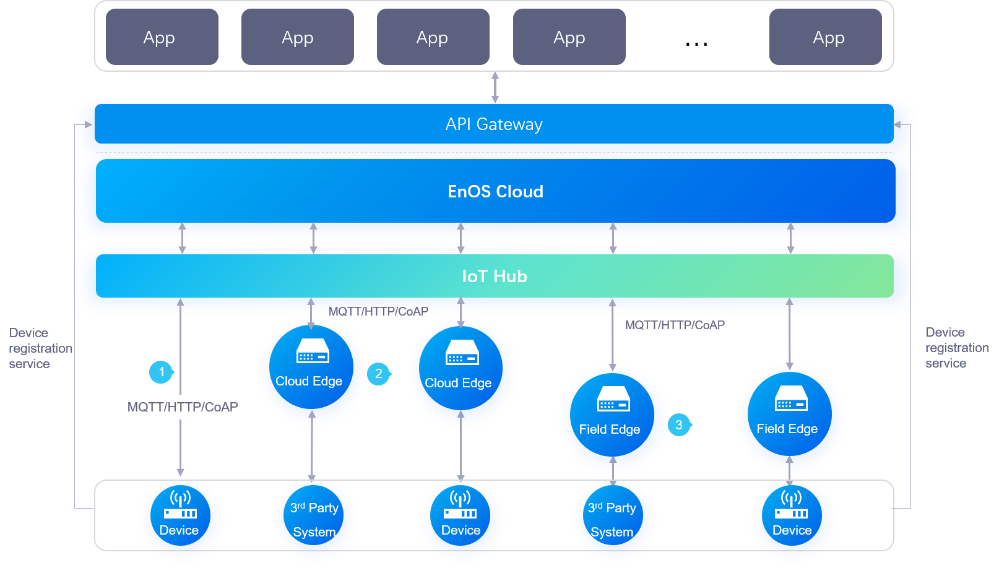

# 设备接入概述

EnOS平台时面向物联网领域开发人员推出的设备管理平台，旨在帮助开发者搭建数据通道，方便终端（如传感器、执行器、嵌入式设备、智能家电等）和云端进行双向通信。

## 主要功能

EnOS接入管理提供以下主要功能：

### 设备接入
物联网平台提供设备端SDK让设备轻松接EnOS网络中。
- 提供MQTT设备SDK，既满足长连接的实时性需求，也满足短连接的低功耗需求。
- 提供直连和通过网关连接等接入方案，解决企业异构网络设备接入管理痛点。

### 设备管理
提供完整的设备生命周期管理功能，包括：
- 设备注册
- 设备属性定义
- 脚本解析？
- 在线调试
- 远程配置
- 固件升级？
- 远程维护？
- 实时监控
- 分组管理？
- 设备删除

### 模型管理
提供设备物模型，简化应用开发

## 功能模块及概念

As shown in the figure above, the following components and concepts are involved in device connection.

### IoT Hub

IoT Hub is a cloud broker service that EnOS™ provides for device connection.

The cloud broker provides the following functions:

- Safe and reliable large-scale bi-directional message transmission from the devices to the cloud.
- Forwarding the data from the client to corresponding subscribers on EnOS™.
- Providing license authorization and creation of thing and policy themes.
- Exposing interface for connections from MQTT clients.

### MQTT
MQTT is a lightweight open-source protocol for Internet of Things based on TCP/IP. MQTT has several key features:

- Support publication and subscription.
- Support data disk persistence.
- The publisher and subscriber use the client ID as a unique token. When multiple clients use the same client ID, the client that initiates the connection after is accepted and the broker disconnect the former connection.

### EnOS™ Edge

Edge is the front end of Envision EnOS™ IoT platform for data acquisition. It is used to collect on-site device data or connected to a third party system for data acquisition and transmission of data to the EnOS™ Cloud. Edge, as software, supports data acquisition, multiple communication conventions, local caching and breakpoint continuation. It can either deployed in a cloud machine or an on-site hardware of a specified brand model. An edge must have a legal serial number (SN) assigned by Envision to be recognized by EnOS™ Cloud.

## Connection methods

EnOS主要提供以下接入方案：
- 设备无需通过网关（在我们的场景中，即edge），直接与云端IoT Hub进行连接及通信，完成鉴权，数据上报的场景。通过该方案连接的设备称为_直连设备_。
- 设备通过edge与EnOS IoT Hub连接。通过该方案连接的设备称为_子设备_。网关代理子设备，帮助他们完成身份的鉴权、上线、数据发送等操作。

通常根据设备的硬件能力及对设备连接的安全性要求选择接入方案。有关接入方案的选择的详细信息，参考 [设备接入方案](connection_scenarios).
