# 添加EnOS Edge网关

当使用EnOS Edge网关接入子设备时，需要对edge网关进行配置，该文章描述如果配置edge网关，完成子设备与edge网关的连接配置。

## 开始前准备<beforestart>

1. 你必须已获得edge网关的序列号（SN）。
2. 你必须已经完成对edge网关的初始化。edge网关硬件初始化等工作通常由远景项目团队完成，详细可以咨询远景的项目经理。

## 步骤1：添加和激活Edge网关<add>

1. 在EnOS控制台中选择**设备Edge接入>Edge管理**。
2. 在页面左上方点击**添加**按钮。
3. 在弹窗中，输入edge网关的名称和序列号。
3. 点击**保存**完成edge网关添加。

Edge网关添加成功后，在**Edge管理**页面，可以查看每一个edge的名称，SN，版本，以及当前通讯状态，发布状态等信息，如下图所示：
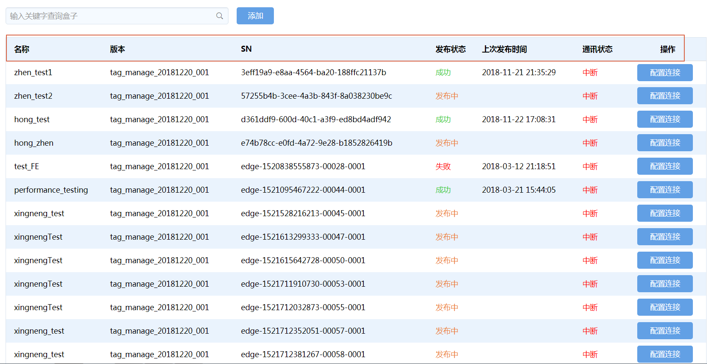

## 步骤2：接入子设备<connect>

完成edge网关的添加后，就可以使用该edge网关完成子设备的数据接入。

1. 在网关设备列表中找到目标edge网关，点击**接入设备**进入配置页面。
2. 在配置页面中，完成下列配置，用以建立子设备与edge网关的连接。

### 添加连接<addconnection>

首要，需要配置连接edge网关。

根据实际需要，一个edge下可添加多个连接，需要根据规约类型选择连接方式。根据以下步骤添加连接：

1. 点击页面中的**添加连接**按钮后。
2. 在弹框中，填写连接的名称，选择连接方式，并根据所选连接方式设置连接参数。
   **注意**：通常edge不会直接连接对端服务器或设备，而是连接到一个网络网关，再由此网关连接到对端服务器或设备，因此需要注意网关IP地址和端口号与Edge的映射配置。

如下图示例，edge作为TCP/IP的客户端，因此配置的连接参数即为服务器的IP地址和端口号。

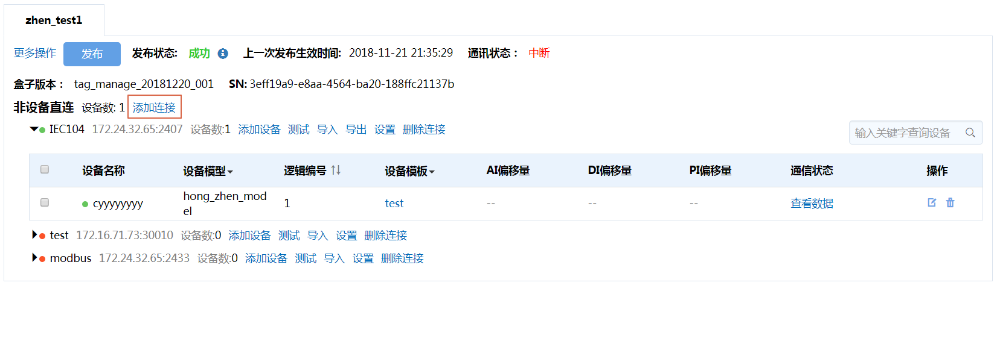

*图：添加连接示例*

### 添加设备<adddevice>

添加连接后，下一步工作是向连接中添加设备。

在本步骤中，你需要添加设备并配置基本信息。

**添加设备**

1. 在连接下点击**添加设备**按钮。
   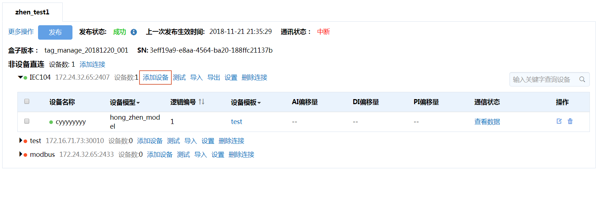

   *图：向连接中添加设备*

2. 在弹出窗口中：
   - 选择需要添加的设备所属的产品。
   - 选择需要添加的设备。
   - 并选择设备需要关联的设备模板，

  **注意**：需首先选择同一种设备，此后才能为这些设备选择设备模板，设备模板相当于设备通讯驱动，里面中包括了设备通讯的点表，通讯规约，规约配置文件等信息。具体可以参考[管理模板](managing_templates)。

3. 点击**保存**添加设备。

**更新设备信息**

若所添加的设备信息需要更新，具体步骤如下：
1. 点击连接边的**导出**下载连接信息表。
2. 更新表中的基本信息。
3. 点击**导入**上传此连接信息表。

**导入**与**导出**按钮如下图所示：

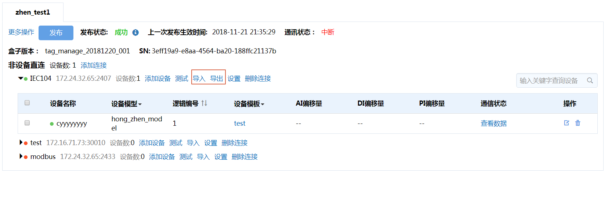

<!--点击设备后的**删除**按钮可以从连接中删除此设备。若需批量删除设备，则勾选此连接下需要删除的设备，而后点击批量删除按钮即可。-->

### 配置逻辑地址或偏移量<configureaddress>

由于一条连接下接入了多个设备，因此需为每个设备配置其逻辑地址及各类点的偏移量。其配置方法取决于所采用的通信规约及其设置。

下列是两种配置的途径：
- 逐个设备进行配置
- 导出设备连接信息表线下配置完成后再导入系统，实现批量配置。

**逐个设备进行配置**

   1. 点击需修改设备后的**编辑**图标。
   2. 根据你的需求进行配置，然后点击**OK**完成配置。

   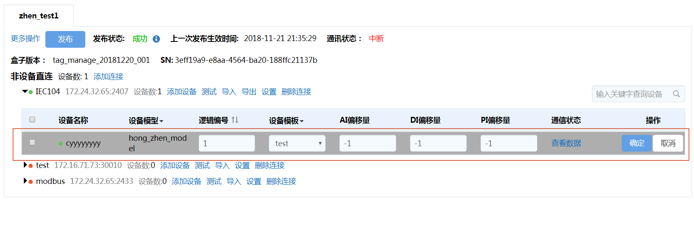

   *图：逐个设备配置逻辑地址及偏移量*

**批量配置**

  1. 点击目标设备连接后的**导出**下载连接信息表。
  2. 根据你的需求修改连接信息表。
     导出的表中支持AI，DI，PI，AO，DO，PO偏移量的配置。基本的配置方式为用短划线连接，如`0-50`，当同时存在多个偏移量时，可用`#`隔离，如`0-50#1000-1050`。
  3. 点击**导入**上传信息表。

### 发布配置<publish>

完成上述各种配置后，需将配置发布到edge。
1. 点击**发布**，即可将配置发布到对应的edge上，并可见发布状态。更新的配置只有在发布后才会生效。

**发布**按钮及发布状态如下图所示：

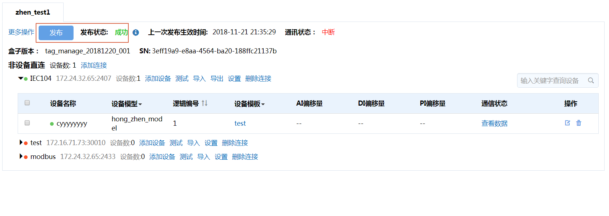

## 步骤3：测试通信<test>

完成并发布到edge后，需检查配置是否正确。在连接配置页面，提供了通信指示灯，当设备在传输层（TCP/IP层）连接正常时，指示灯为绿色，否则为红色。如下图所示：

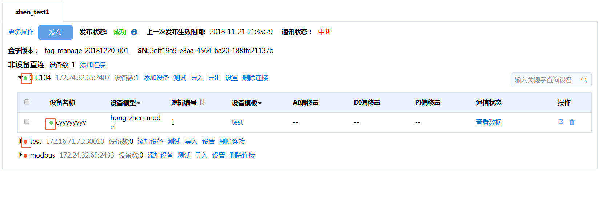

*图：传输层通信状态指示图标*

通信中断的原因有多种，包含但不限于以下原因：
- 配置没有下发
- 配置有误
- 场站端的通信有异常
为此，需要有进一步的调试来帮助用户定位问题所在。EnOS Edge提供了通信测试功能以帮助实现此目标。

**根据下列步骤调试通讯：**

1. 点击设备连接后的**测试**进入批量测试页面，如下图：
2. 在批量测试通信页面，你可以：
   - 通过下拉菜单切换连接。
   - 点击**开始/暂停**按钮以启动或暂停通信测试。
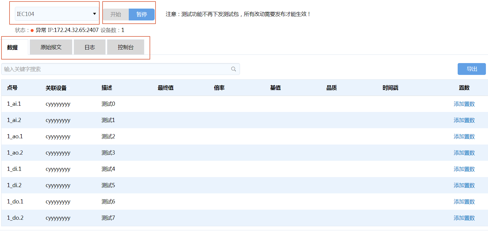

*图：批量通信测试概览*

批量测试提供了4项功能，分别为：数据、原始报文、日志和控制台。通过点击相应的标签页可以在不同功能间切换，以下内容描述各标签页用法及信息含义：

### 数据<data>

在**数据**标签，你可查看本连接下的所有设备，或者筛选所需查看的设备，查看其在edge中的采集点数据更新情况。

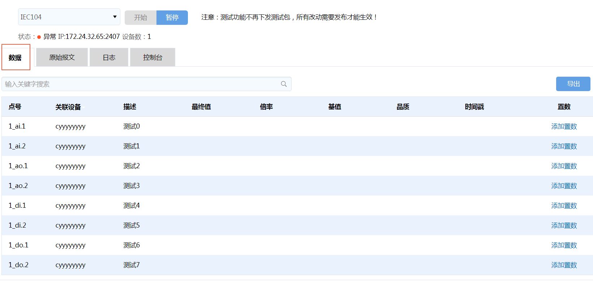

*图：数据功能*

**设置置数**
你可设置遥测、遥信点的置数如下步骤：

1. 点击**添加置数**设值，
2. 点击**发送**后可向云端发送所设置的值。点击一次发送一次，不会终止原始数据的上传，相当于插入一个值送上云端。

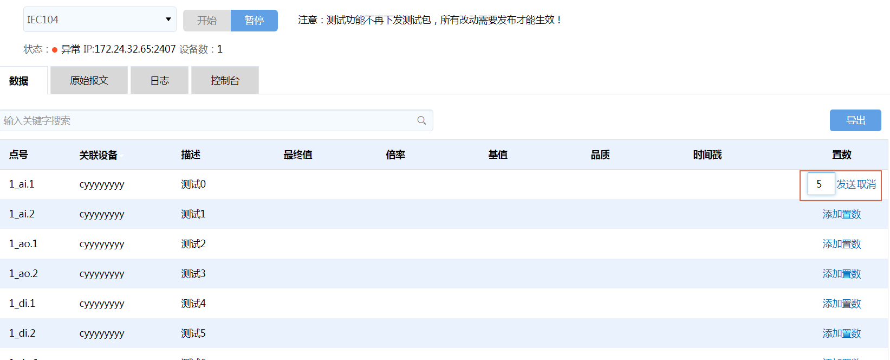

*图：置数功能*

### 原始报文<datagram>

在**原始报文**标签，你可以查看和复制原始收发报文。

### 日志<log>

为避免信息泛滥，该标签页隐藏了info类日志，只显示warning和error类型的日志，用于辅助用户判断通信故障原因。

### 控制台<console>

在**控制台**标签，你可以使用常用的通信调试命令包括：
- 基本ping测试（需在输入框中填写需要ping的IP地址）
- 本机IP查看
- Telnet命令（Telnet测试需填写IP和端口号）
- TCP连接查看命令

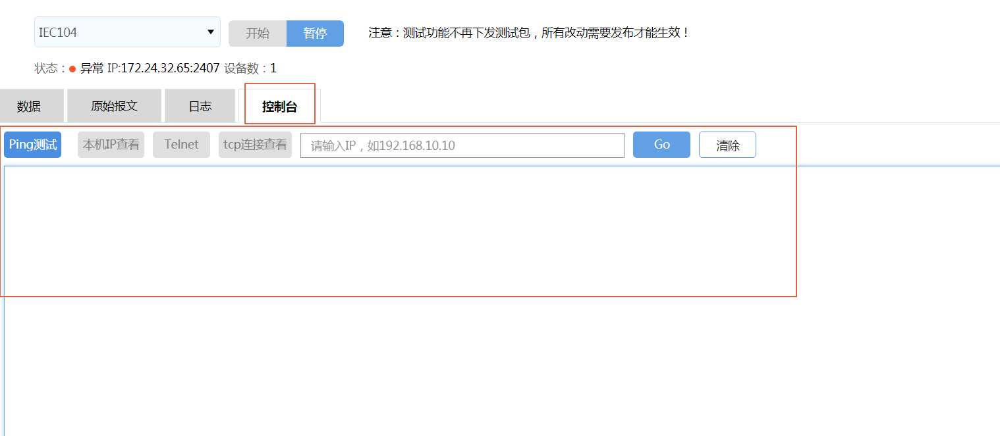

*图：控制台功能*

### 单台设备的通信测试<communicationsingle>

在每一个连接下的的设备列表页面，你可以测试单台设备的通信：
1. 点击目标设备后的**查看数据**，可对单台设备进行通信测试，查看此设备对应的edge中的数据。此功能与批量通常测试中的数据功能一致，只是这里仅对单台设备进行测试。

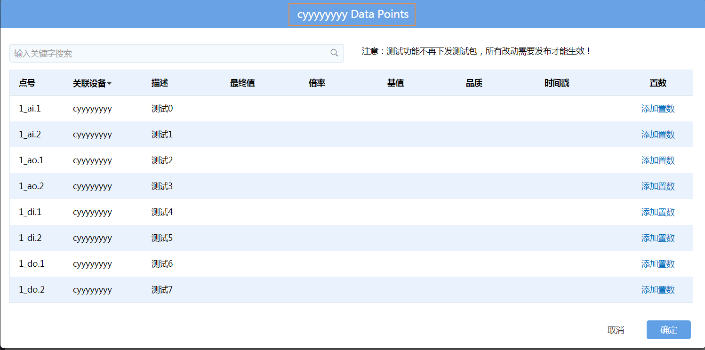

*图：单台设备通信测试功能*

## 总结<result>

在edge网关中完成子设备的接入配置后，这些子设备的数据即会自动上送到EnOS云端。
