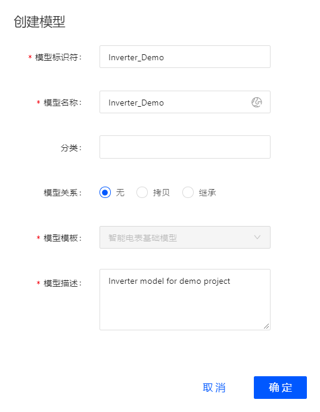

# Getting started with device connection through edge
<!--
The short description should be a single, concise paragraph that contains one or two sentences and no more than 50 words.
Briefly mention what the user's learning goal is and include the following SEO keywords in the title short description: EnOS, ServiceName, tutorial.
-->
This article instructs how to connect devices into EnOS Cloud through edge.

## 任务描述

本示例以逆变器通过edge接入EnOS Cloud为例进行说明如何创建设备模型，产品，及设备，以完成逆变器接入的相关配置。

## 开始前准备

 1. 根据业务需求选定设备合适的接入配置方式，详细请参考[设备接入方案](connection_scenarios.md)。
 2. 根据业务需求定义模板类型。详细请参考[物模型介绍](device_model_overview.md)和[创建物模型](creating_tsl.md)。

<!--@Fish, getting started不是把所有配置属性都放这里讲，它只是一根线，把详细的how-to task串起来，但是getting started可以是有例子的，徐伟原来的版本是可以让用户按着做就能配出简单结果的，那就把例子用上，请严格按照徐伟的例子写这个topic。如果没有例子，getting started是一个high-level的procedure-->
## 第一步：创建设备模型

1. 在EnOS控制台中选择**接入管理 > 模型管理**。
2. 点击在页面右上方**创建模型**, 并在**创建模型**窗口提供以下配置信息：
  - **模型标识符**： inv_demo1
  - 模型名称：inverter
  - 分类：solar
  - 模型关系：无
  - 模型模板：无
  - 模型描述：power inverter
  <!--@Fish, 因为markdown格式的表格生成有问题，避免用表格，换成list，或者后续用rst语法写文件的时候用表格-->

  

3. 点击**确定**完成操作。
4. 点击**查看**，在模型详细信息界面中点击**功能定义**标签。
5. 点击**新增**，并在**添加功能**窗口提供以下配置信息：
  - **属性1**
    - **名称**：逆变器类型
    - **标识符**：invType
    - **数据类型**：enum
    - **枚举项**：
      - 参数值：0；参数描述：组串式
      - 参数值：1；参数描述：集中式

  - **测点**
  - **服务**
  - **事件**

有关设备模型设置的详细信息，参见[创建模型](creating_model)。
<!--@Fish, 如上面说的，有example的，这里直接写设置成什么，如果用户需要知道参数的详细含义，参见how-to topic-->

## 第二步：创建网关模型

网关设备同样需要模型，但是网关设备通常情况下可以不定义属性、测点、服务、事件四要素。按照向导定义一个edge模型，模型四要素为空。

1. 在EnOS控制台中选择**接入管理 > 模型管理**。

2. 点击在页面右上方**创建模型**, 并在**创建模型**窗口提供以下配置信息。
  <!--信息窗口是什么？-->
  <table>
      <tr>			
  		  <th>参数
  			</th>
  		  <th>输入值
  			</th>
  		</tr>
  		<tr>
  		  <td> 模型标识符		
  			</td>
  			<td>模型的唯一识别符
  			</td>
  		</tr>
      <tr>
  		  <td> 模型名称			
  			</td>
  			<td>模型的名称
  			</td>
  		</tr>
  		<tr>		
  		  <td>分类			
  			</td>
  			<td>添加自定义分类。在信息窗口，可通过分类对模型进行筛选。
  			</td>
  		</tr>
  		<tr>
  		  <td>模型关系		
  			</td>
  			<td>设置为无
  			</td>
  		</tr>
  		<tr>
  		  <td> 模型模板			
  			</td>
  			<td>无需选择
  			</td>
  		</tr>
  				<tr>
  		  <td> 模型描述		
  			</td>
  			<td>例如：edge模型
  			</td>
  		</tr>
  		</table>
3. 点击**确定** 完成操作。

## 第二步：创建产品
1. 在EnOS控制台中选择**接入管理 > 产品管理**。
2. 点击在页面右上方**创建产品** ，在**创建产品**窗口提供以下配置信息。
  <table>
    <tr>
  		<th>参数
  		</th>
  		<th>输入值
  		</th>      
  	</tr>
    <tr>
  		<td>产品名称
  		</td>
  		<td>产品名不可重复，支持中文、英文字母、数字和下划线
  		</td>      
  	</tr>
    <tr>
  		<td>节点类型
  		</td>
  		<td>选择设备
  		</td>
  	</tr>
    <tr>
  		<td>设备模型
  		</td>
  		<td>选择一个已定义好的模型。如果选择的模型还未定义功能，则可在产品创建后再设置。
  		</td>
  	</tr>
    <tr>
  		<td>数据格式
  		</td>
  		<td>JSON:
      透传：
  		</td>
  	</tr>
    <tr>
  		<td>产品描述
  		</td>
  		<td>产品名称
  		</td>
  	</tr>
3. 点击**确定** 完成操作。

有关产品设置的详细信息，参见[创建产品](creating_products)。
<!--@Fish, 你缺少这个how to topic-->

## 第三步：创建网关产品
1. 在EnOS控制台中选择 **接入管理 > 产品管理**。
2. 点击在页面右上方 **创建产品** ，可配置信息如下。
<table>
  <tr>
		<th>参数
		</th>
		<th>描述
		</th>
    <th>Value range
		</th>
	</tr>
  <tr>
		<td>产品名称
		</td>
		<td>产品名不可重复
		</td>
    <td>
     支持中文、英文字母、数字和下划线
		</td>
	</tr>
  <tr>
		<td>节点类型
		</td>
		<td>选择网关
		</td>
    <td>-</td>
	</tr>
  <tr>
		<td>设备模型
		</td>
		<td>选择一个已定义好的edge模型。
		</td>
    <td>-</td>
	</tr>
  <tr>
		<td>数据格式
		</td>
		<td>Json:
    透传：
		</td>
    <td>-</td>
	</tr>
  <tr>
		<td>产品描述
		</td>
		<td>网关的描述
		</td>
    <td>-</td>
	</tr>

## 第四步：添加网关

1. 在EnOS控制台中选择 **接入管理>设备管理**。
2. 点击在页面右上方 **添加设备**，可配置信息如下。

<table>
  <tr>
		<th>参数
		</th>
		<th>描述
		</th>
    <th>Value range
		</th>
	</tr>

  <tr>
		<td>产品
		</td>
		<td>设备所归属的产品。例如：Edge_Product
		</td>
    <td>
     -
		</td>
	</tr>
  <tr>
		<td>DeviceName
		</td>
		<td>设备名，在同一产品下可重名。例如：Edge01
		</td>
    <td>-</td>
	</tr>
  <tr>
		<td>Devicekey
		</td>
		<td>可选填。
    如果不填，则系统自动生成
    如果填：同一产品下不可重复
		</td>
    <td>-</td>

有关设备设置的详细信息，参见[创建设备](creating_device)。

## 第五步：添加设备
归属于某个产品下的具体设备。平台为设备颁发产品内唯一的证书DeviceKey。设备可以直接连接平台，也可以作为子设备通过网关连接物联网平台。

1. 在EnOS控制台中选择 **接入管理>设备管理**。
2. 点击在页面右上方 **添加设备** ，可配置信息如下。

<table>
  <tr>
		<th>参数
		</th>
		<th>描述
		</th>
    <th>Value range
		</th>
	</tr>

  <tr>
		<td>产品
		</td>
		<td>设备所归属的产品。根据产品配置的不同，会出现相应的选项。
		</td>
    <td>
     -
		</td>
	</tr>
  <tr>
		<td>DeviceName
		</td>
		<td>设备名，在同一产品下可重名。例如：Inv01。
		</td>
    <td>-</td>
	</tr>
  <tr>
		<td>Devicekey
		</td>
		<td>可选填。
    如果不填，则系统自动生成
    如果填：同一产品下不可重复
		</td>
    <td>-</td>

## 第六步：添加标签

设备标签：通常根据设备的特性为设备添加的特有的标记，您可灵活自定义标签内容。

1. 在EnOS控制台中选择 **接入管理>设备管理**。
2. 点击需要添加标签的模型后的 **查看**，在标签信息处点击 *** 来添加标签。

## 第六步：上线设备

1. 下载设备端SDK，选择连接协议。请参考,[SDK设备端连接](using_sdk)

2. 使用Topic向设备端发送以下requests，是设备上线：

网关上线
网关添加子设备
子设备上线

## 第七部：查看状态

进入控制台，选择**接入管理>设备管理**，查看Edge01和INV01设备的状态，验证设备是否处于在线状态。
