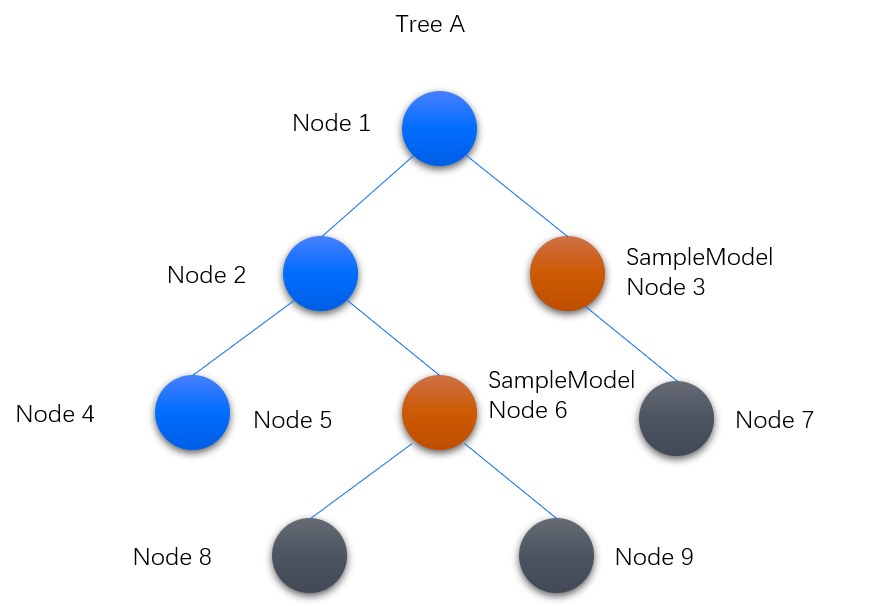
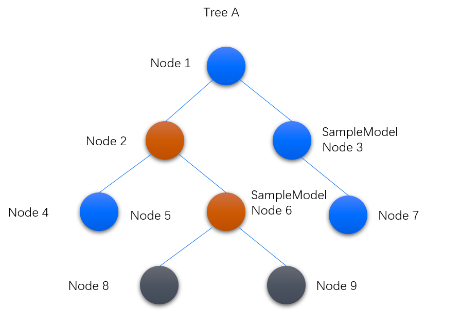

# 屏蔽告警

屏蔽告警，指的是对资产树内某个节点以下的资产告警进行屏蔽。

下图通过一个例子描述告警屏蔽的机制：
- 图中的资产树中Node 3和Node 6为同一模型SampleModel的设备实例。
- SampleModel根据告警规则的定义，作用于Tree A，并开启了告警屏蔽。

在该例子中，告警屏蔽将作用于Node 3和Node 6。即：
- 当Node 3和Node 7同时产生告警，则只接收Node 3的告警，屏蔽Node 7的告警。
- 当Node 6，8，9同时产生告警，则只接收Node 6的告警，屏蔽Node 8和9的告警。
- Node 1，2，4虽然属于Tree A，但是非SampleModel的实例，所以不受该条告警规则的约束。

假设在一个路径上有多个SampleModel的实例，在下图中，如果Node 2也是SampleModel的实例，告警规则同时作用于Node 2和Node 6，但是应用只会收到路径最顶部，即Node 2的告警。

## 使用场景

告警屏蔽适用于以下场景：

当父节点因某种原因产生了告警，与其关联的其他节点也必定会产生告警。比如当箱式变电站发生了跳闸而产生*主告警*，其子设备逆变器，汇流箱等也会因状态变化而产生大量*衍生告警*，产生告警的根因仍然是父节点的跳闸。在该情况下，应用只要接收主告警，而不接收*衍生告警*。

## 开启告警屏蔽

屏蔽在**告警规则**中开启，开启屏蔽的前提条件为：资产所属模型已定义告警规则，且作用域为选定资产树或资产树的一部分。具体步骤如下。

1. 在EnOS Console的导航菜单中，选择 **告警管理 > 告警规则**。

2. 点击**操作**栏的编辑按钮。

 .. |edit| image:: ../../media/button_edit.png

3. 检查**作用域**的设置，须为指定资产树或资产树的一部分。

4. 开启**告警屏蔽**，点击 **确认** 保存设置。

## 结果

当开启告警屏蔽后，衍生告警默认不会被上报到应用端，应用可通过开启以下告警服务API中的`includeDerivative`参数获取衍生告警的信息：
- Search Active Alerts
- Search History Alerts

有关API的调用，在**EnOS Console > EnOS API**中查看对应的文档。

