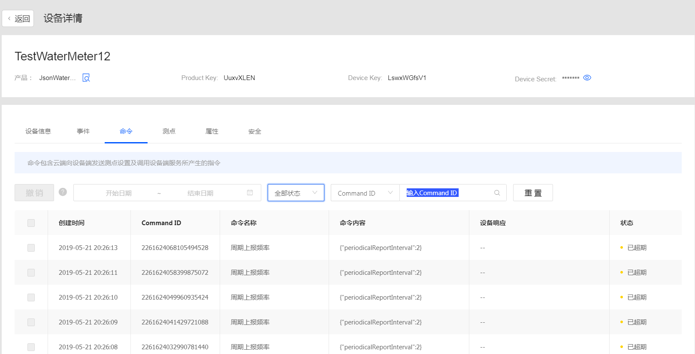

# 管理云端指令缓存

在设备与云端连接断开，或在低功耗设备因长期休眠无法及时获取及执行云端指令的场景下，你可以通过云端缓存指令功能管理指令，并可对下发的指令进行状态跟踪。

发送缓存的指令前，云端会先判断设备是否在线：
- 如果设备在线则直接进行下发，并获得返回的响应信息，同即时下发场景。
- 如果设备处于离线状态，则云端首先将该条指令加入到此设备的缓存下发队列中，缓存队列是一个有序的队列，等待设备重新与云端建立连接后，云端对缓存的指令按顺序进行串行下发。

## 指令状态

- **已创建**：云端接收指令并创建，但未发送给设备。
- **已取消**：该指令已被撤销，只有处于**已创建**状态的指令才能被撤销。
- **已超期**：指令超过指定的有效期，置为过期。有效期可以由应用指定，默认值为0s，即应用不指定的话即作为即时命令下发，有效期最大值不超过48小时（172800s），对于超过有效期的缓存指令，云端需要从缓存队列中自动清除，并将状态置为**已超期**。
- **已下发**：云端已将指令投递到设备的下行消息通道中，但设备尚未响应。注意，该状态不代表一定发送成功；
- **发送成功**：设备接收指令并返回响应信息。注意，该状态不代表执行的结果，设备可以在响应信息中带上自定义的业务描述信息desc（可选）。
- **发送失败**：指令因为各种原因发送失败，该条指令无法被正确的投递到下行消息通道中，可以原因为：设备离线、脚本解析错误，无效指令等。
- **响应超时**：指令发送到设备下行消息通道，设备在timeout周期内进行3次重试直至超时仍无响应。

## 规则

有关云端指令缓存功能有如下规则：

- **缓存有序下发**：设备处理并返回上一条指令的响应信息后，云端才会发送下一条缓存指令，上一条指令的处理结果包括：发送成功（设备接收指令并正常响应）和响应超时（云端已经发送了指令但是设备没有及时响应）；

- **指令优先级**：缓存指令无优先级。在缓存指令尚未处理完，而应用侧又重新发送了一条新指令的情况下，无论新指令是即时下发的还是缓存下发的，都仍会加入到队列中等待。如果需要优先发送新指令，应用侧可以首先对缓存的指令进行撤销操作，才可下发新的指令。也就是当设备在线的情况，缓存队列中，同时存在缓存指令和立即下发的指令，则所有指令会顺序下发，如果此时设备下线了，则立即下发的指令将自动失败。


| 项目                           | 限制                                |
|--------------------------------|-------------------------------------|
| 单个设备支持的最大的指令缓存量 | 50                                  |
| 缓存指令有效期                 | 0 – 48 小时 (17800s)，0代表立即下发 |
| 设备历史命令存储时长           | 7天                                 |


## 开始前准备<beforestart>

- 你需要有设备管理操作权限，如果没有请联系组织管理员添加，参见[策略，角色，与权限](/docs/iam/zh_CN/dev/access_policy)。

## 设备端开发

设备可以在响应信息中带上自定义的业务描述信息以说明指令执行的状态，响应数据格式如下,`desc`为描述字段。
```json
{
    "id": "123",
    "code": 200,
    “desc”：“该指令已成功执行”                //显示自定义的描述信息,可选
    "data": {                                //显示模型中定义的输出参数，允许为空
               "outputdata1":234,
               "outputdata2":"xyz"
              }
}
```

## 发送指令

应用可通过调用以下API进行指令的下发：
- `invokeService`：通过指令调用设备服务
- `setMeasurepoint`：通过指令对测点进行置数
有关API的使用，在EnOS控制台点击**EnOS API > API 文档**进行查看。

## 查看指令

1. 在控制面板中选择 **设备管理**。
2. 选择需查看指令的设备，并在**操作**一栏点击查看图标。
3. 在**设备详情**页面，点击**命令**页签，即可查看当前设备当前的所有缓存指令。



你可以在该查看页面进行以下操作：
- 根据条件筛选需查看的指令
- 对于**已创建**而未下发的指令，你可以撤销指令。