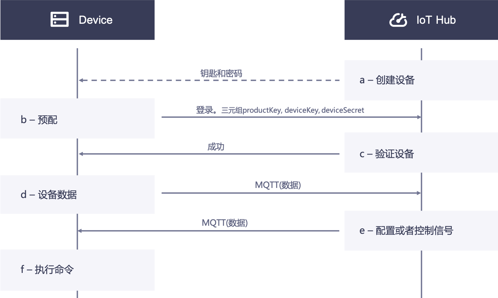

# 基于密钥的单向认证

基于密钥的认证是指基于设备三元组，即`ProductKey`、`DeviceKey`和`DeviceSecret`，对设备进行鉴权。

## 概念<concepts>

设备与EnOS IoT Hub连接主要涉及以下操作及状态：

- **注册**
  即在云端创建一个设备，可以在基于网络的EnOS控制台中创建，也可以通过调用REST API来创建。

- **登录**
  设备上送数据之前，首先必须成功登录，然后才可以发送数据。设备登录需要使用设备三元组鉴权。

- **激活**
  设备首次登录成功后会被激活，将设备从**未激活**状态更新为**已激活**状态。**已激活**状态包含**在线**和**离线**两个子状态，在EnOS控制台中会使用**在线**和**离线**两个子状态来代替显示**已激活**状态。

### 设备激活模式和设备状态<deviceactivation>

在EnOS平台初次创建的设备是默认处于启用但未激活的状态，等待被激活。设备激活分为动态激活和静态激活。
- **动态激活**

动态激活过程如下：
  1. 设备首次尝试连接时携带`ProductKey`，`ProductSecret`，`DeviceKey`来请求激活，鉴权通过以后，返回`DeviceSecret`给设备。
  2. 设备通过`ProductKey`，`DeviceKey`，`DeviceSecret`来尝试登录。
  3. 设备成功登录后，设备状态从**未激活**变成**在线**状态。此时设备可以上送数据，如果一段时间内不上送数据，设备状态变成**离线**。

  如需采用动态激活方式，你需要在产品配置中开启**动态激活**。

- **静态激活**：

静态激活的过程如下：
  1. 设备发送携带`ProductKey`，`DeviceKey`，`DeviceSecret`的登录请求。
  2. 设备登录成功以后，设备状态从**未激活**变成**在线**状态。此时设备可以上送数据，如果一段时间内不上送数据，设备状态变成**离线**。

如果发现设备异常，或者你不希望接收该设备的数据，可以将其置为**禁用**。此时设备将自动下线，并处于**离线**状态。

设备整体的状态可以分为操作状态、激活状态、连接状态三个维度，如下表所示：

<table>
   <tr>
     <th>操作状态</th>
     <th>激活状态</th>
     <th>连接状态</th>
   </tr>
   <tr>
     <td>禁用</td>
     <td></td>
     <td>离线</td>
   </tr>
   <tr>
     <td>启用</td>
     <td>未激活</td>
     <td></td>
   </tr>
   <tr>
     <td></td>
     <td>已激活</td>
     <td>在线</td>
   </tr>
   <tr>
     <td></td>
     <td></td>
     <td>离线</td>
   </tr>
</table>

## 设备认证过程<authentication>

设备连接主要认证过程如下：
- a. 云端预注册设备。
- b. 在edge端配置云端注册的设备信息，主要为烧录设备三元组。
- c. Edge上电、联网、尝试登录。云端验证设备三元组：
  - 成功：返回成功，告知设备发送数据。
  - 失败：返回失败，中断连接。
- d. 设备以MQTT协议发送数据。
- e. 云端以MQTT协议下发命令。
- f. 设备端响应云端请求。

具体流程图如下：

